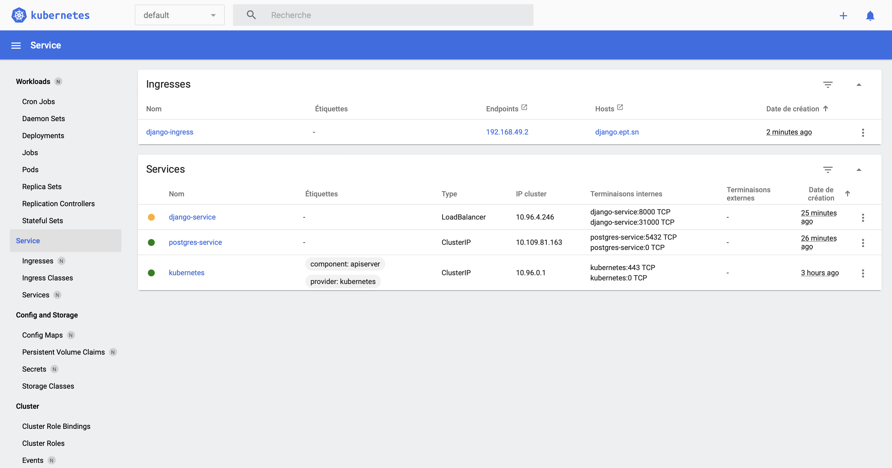

# DevOps Course Project

## Run APP

Clone the repository and move to the directory containing the `docker-compose.yaml` file inside your commande line and execute the following command to run the app.

```bash
docker-compose -f docker-compose.yml up -d
```

The compose.yml file is an old version of our docker-compose in which we can have access have to the PGAdmin interface.

But in the new version(`docker-compose.yml`), we removed the PGAdmin container.

## Images

- [PGAdmin 4 web interface for postgresql database management](http://localhost:8888/browser/)


- [First Endpoint - Get infomation about all users in the database](http://127.0.0.1:8000/get_users/)


- [Second Endpoint - Count the numbers of visits on the endpoint](http://127.0.0.1:8000/count_visits//)


## Kubernetes

To deploy the app locally, here are the steps.

```bash
cd kubernetes/
kubectl apply -f secret.yml
kubectl apply -f postgres.yml
kubectl apply -f django.yml
minikube service django-service
```

- Deployed APP


- Services



- Pods


- StatefulSet


- ReplicaSets


- Config & Storage


## Authors

Job done by `Mouhamadou Naby DIA`, `Abdoulkhadre DIALLO`, `Nassr Eddine El HIMEUR` & `Serigne Saliou WADE`.
